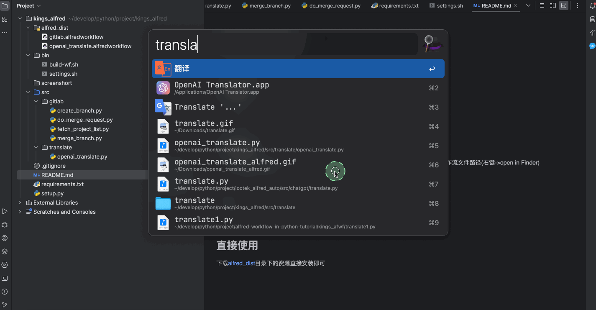
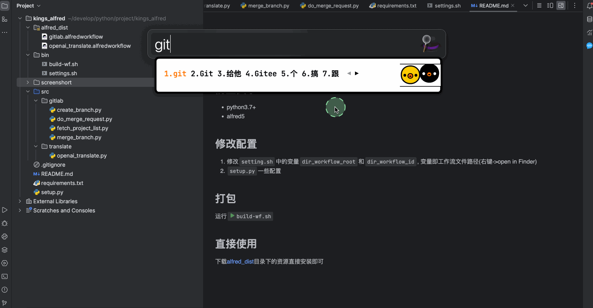

# Python alfred
利用Python制作[Alfred](https://www.alfredapp.com/) [workflow](https://www.alfredapp.com/workflows/)

## 前置要求
* python3.7+
* alfred5

## 修改配置
1. 修改`setting.sh`中的变量`dir_workflow_root`和`dir_workflow_id`, 变量即工作流文件路径(右键->open in Finder)
2. `setup.py`一些配置

## 打包
运行`build-wf.sh`

## 示例
1.Open ai翻译

2.Gitlab常用操作

## 直接使用

下载[alfred_dist](alfred_dist)目录下的资源直接安装即可

## 参与贡献
欢迎提供其他python workflow脚本，提交PR
